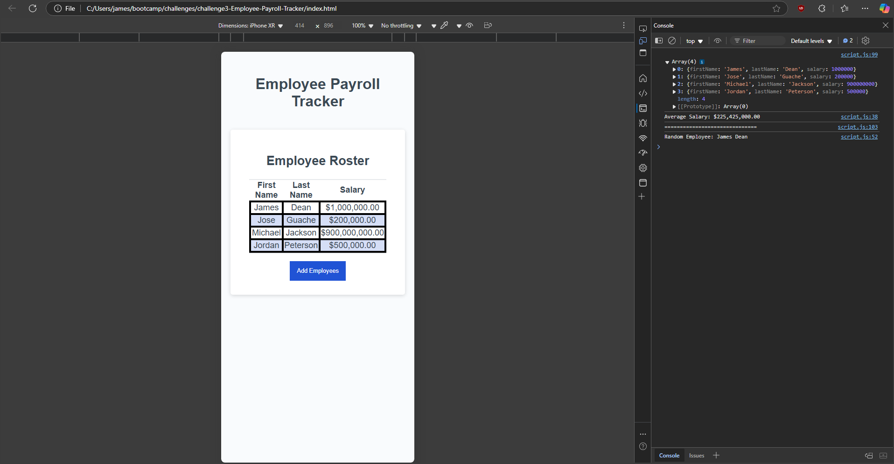

# challenge3-Employee-Payroll-Tracker

## Description

The Employee Payroll tracker is a simple website that allows users to input an employees name, last name, and salary in order to help keep a track of a businesses salary expenses. It also finds the average salay across all employees, as well as picking a random employee from the array as a sort of lottery system. The site is very simple as it only contains a little bit of JavaScript, CSS, and HTML.

## Usage

**Repo**

[GitHub Repo] (https://github.com/JoseGuache/challenge3-Employee-Payroll-Tracker)

**Live Link**

[GitHub Pages link] (https://joseguache.github.io/challenge3-Employee-Payroll-Tracker/)

## Credits

I used the [Professional README Guide] (https://coding-boot-camp.github.io/full-stack/github/professional-readme-guide) to make sure my README met the required and expected standards. I also used [mdn wen docs] (https://developer.mozilla.org/) to make sure I was using isNAN() correctly.

## License

